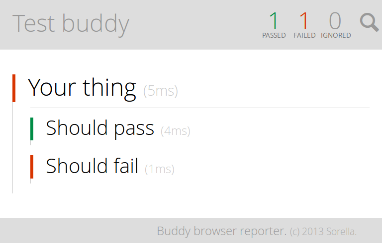

# brofist-browser

Browser reporter for [Brofist](https://github.com/brofistjs/brofist).

## Example

You pass the `brofist-browser` library as your reporter:

```js
var spec   = require('brofist')()

spec('Your thing', function(it) {
  it('Should pass', function() {

  })

  it('Should fail', function() {
    throw new Error('boo')
  })
})

spec.run(require('brofist-browser')())
```

Then point the server to your file:

```bash
$ brofist-browser serve your-file.js
```

And get back this deliciously rich output!




## Installing

Just grab it from NPM:

    $ npm install brofist-browser
    $ npm install -g brofist-browser # To get the command line thingie
    
## Licence

MIT/X11. IOW you just do whatever the fuck you want to ;3
